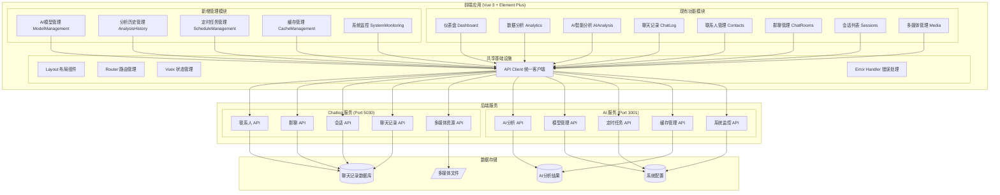
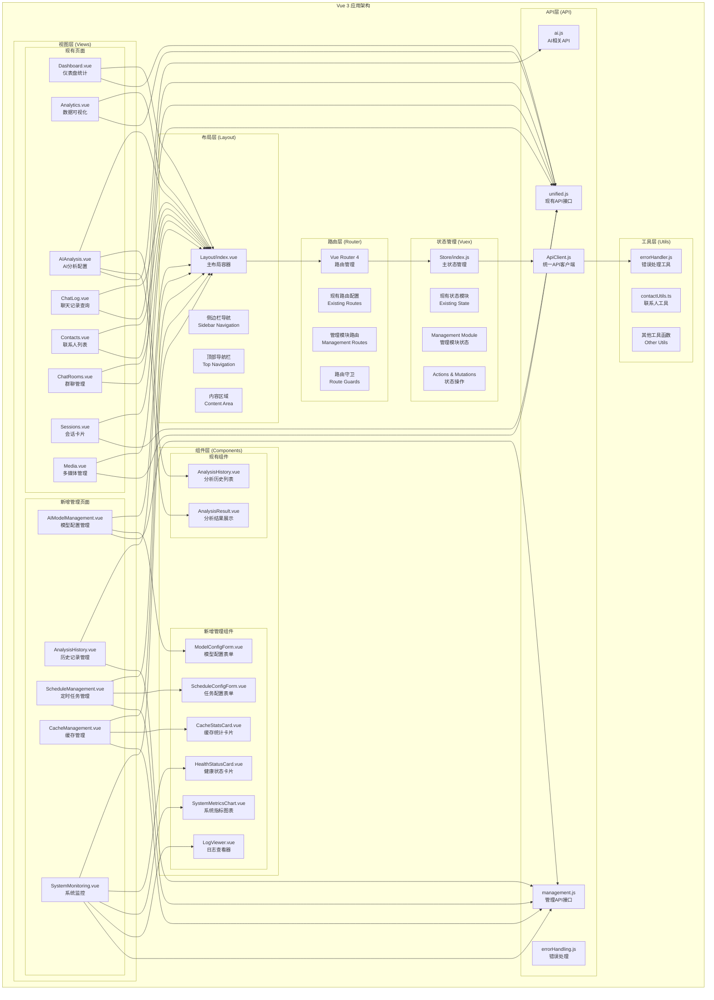
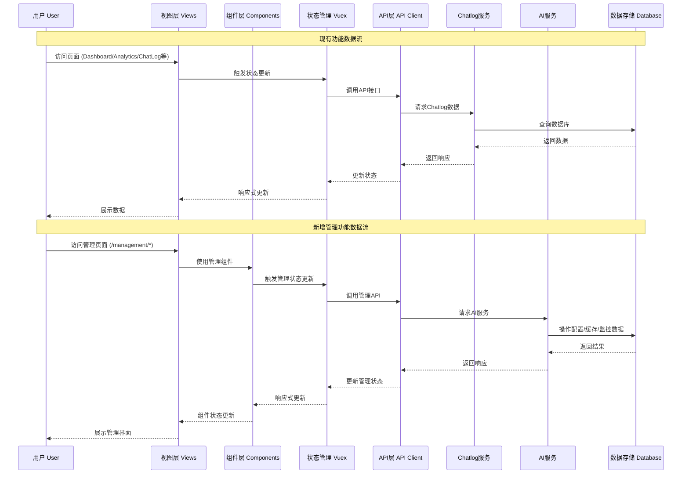

# 聊天记录管理系统 - 完整系统架构图

## 📊 系统总览



## 🏗️ 前端架构详细图



## 🔄 数据流架构图



## 🗂️ 文件结构架构图

```
apps/frontend/src/
├── 📁 views/                          # 页面组件
│   ├── 📄 Dashboard.vue               # ✅ 现有 - 仪表盘
│   ├── 📄 Analytics.vue               # ✅ 现有 - 数据分析
│   ├── 📄 AIAnalysis.vue              # ✅ 现有 - AI分析
│   ├── 📄 ChatLog.vue                 # ✅ 现有 - 聊天记录
│   ├── 📄 Contacts.vue                # ✅ 现有 - 联系人
│   ├── 📄 ChatRooms.vue               # ✅ 现有 - 群聊
│   ├── 📄 Sessions.vue                # ✅ 现有 - 会话
│   ├── 📄 Media.vue                   # ✅ 现有 - 多媒体
│   └── 📁 management/                 # 🆕 新增 - 管理模块
│       ├── 📄 AIModelManagement.vue   # 🆕 AI模型管理
│       ├── 📄 AnalysisHistory.vue     # 🆕 分析历史管理
│       ├── 📄 ScheduleManagement.vue  # 🆕 定时任务管理
│       ├── 📄 CacheManagement.vue     # 🆕 缓存管理
│       └── 📄 SystemMonitoring.vue    # 🆕 系统监控
├── 📁 components/                     # 组件库
│   ├── 📁 analysis/                   # ✅ 现有 - 分析组件
│   │   ├── 📄 AnalysisHistory.vue     # ✅ 分析历史列表
│   │   └── 📄 AnalysisResult.vue      # ✅ 分析结果展示
│   └── 📁 management/                 # 🆕 新增 - 管理组件
│       ├── 📄 ModelConfigForm.vue     # 🆕 模型配置表单
│       ├── 📄 ScheduleConfigForm.vue  # 🆕 任务配置表单
│       ├── 📄 CacheStatsCard.vue      # 🆕 缓存统计卡片
│       ├── 📄 HealthStatusCard.vue    # 🆕 健康状态卡片
│       ├── 📄 SystemMetricsChart.vue  # 🆕 系统指标图表
│       └── 📄 LogViewer.vue           # 🆕 日志查看器
├── 📁 layout/                         # 布局组件
│   └── 📄 index.vue                   # ✅ 现有 - 主布局 (需扩展导航)
├── 📁 router/                         # 路由配置
│   └── 📄 index.js                    # ✅ 现有 - 路由配置 (需扩展管理路由)
├── 📁 store/                          # 状态管理
│   ├── 📄 index.js                    # ✅ 现有 - 主状态管理
│   └── 📁 modules/                    # 状态模块
│       └── 📄 management.js           # 🆕 新增 - 管理状态模块
├── 📁 api/                            # API接口
│   ├── 📄 ApiClient.js                # ✅ 现有 - 统一API客户端
│   ├── 📄 unified.js                  # ✅ 现有 - 统一API接口
│   ├── 📄 ai.js                       # ✅ 现有 - AI相关API
│   ├── 📄 management.js               # 🆕 新增 - 管理API接口
│   ├── 📄 index.js                    # ✅ 现有 - API入口
│   └── 📄 errorHandling.js            # ✅ 现有 - 错误处理
├── 📁 utils/                          # 工具函数
│   ├── 📄 errorHandler.js             # ✅ 现有 - 错误处理工具
│   ├── 📄 errorHandler.ts             # ✅ 现有 - TS错误处理
│   └── 📄 contactUtils.ts             # ✅ 现有 - 联系人工具
├```
─── 📁 tests/                          # 测试用例
│   ├── 📁 unit/                       # 单元测试
│   │   ├── 📄 ModelConfigForm.test.js # 🆕 模型配置表单测试
│   │   ├── 📄 ScheduleConfigForm.test.js # 🆕 任务配置表单测试
│   │   ├── 📄 CacheStatsCard.test.js  # 🆕 缓存统计卡片测试
│   │   └── 📄 HealthStatusCard.test.js # 🆕 健康状态卡片测试
│   └── 📁 integration/                # 集成测试
│       ├── 📄 api.test.js             # ✅ API集成测试
│       └── 📄 management.test.js       # 🆕 管理模块集成测试
└─── 📄 App.vue                        # ✅ 现有 - 主应用组件